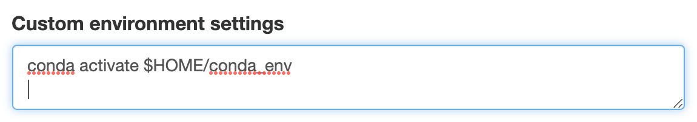

# Conda Environments for Python

One method of installing Python packages is to use [Conda Environments](https://docs.conda.io/projects/conda/en/latest/user-guide/tasks/manage-environments.html).

> [!WARNING]
> If you need `mpi4py`, you should avoid using _Conda_ environments if possible to avoid potentially significant performance issues. See the [instructions for mpi4py](applications/python/python_venvs) for more information.

## Creating a virtual environment

The general workflow is to do the following:

1. Load a version of _Conda_
2. Create the virtual environment

### Loading a version of _Conda_

There are two main sources of _Conda_. One is in the _Pyhton_ module and the other is in the _Intel_ compiler suite

You can load these with:

```bash
# load Anaconda using the Python module
module load python/3
```

or

```bash
# load Conda using the Intel module
module load intel/oneAPI-2021
```

Alternatively, if you require a newer version of _Conda_ or just want more control, we suggest [installing _Miniconda_ locally](applications/python/miniconda).

The first time you load _Conda_, you should run

```bash
conda init bash
```

assuming you are using the default ```bash``` shell. If you are using a different shell, replace ```bash``` with your shell name (e.g. ```zsh``` or ``tcsh``). This will add some initialization scripts for _Conda_ to your shell profile (```.bashrc``` if you are using the default ```bash```). For these changes to take effect, you either need to log out and log back in or run

```bash
source $HOME/.bashrc
```

(if you are not using ```bash``` you should replace ```.bashrc``` with your shell profile.)

### Creating Virtual Environments From Command Line

For simple environments with a small number of packages, you can create an environment named `conda_env` (or any name of your choosing) in your home directory with

```bash
conda create -p $HOME/conda_env python=3.8 package1 package2 package3
```

The `-p` tells _Conda_ to install all the files in the directory `$HOME/conda_env`. Here, we request _Python_ version 3.8 and the packages `package1 package2 package3` which are the packages you'd like to install (e.g. `numpy`, `tensorflow`, etc.). In general, it is a good idea install all the packages at the same time becasue _Conda_ will do a better job of resolving dependencies.

### Creating Virtual Environments From environment.yml File

For environments that contain more than a few packages, we suggest creating a `environment.yml` file (note, you can name the file anything you'd like, but it is common practice to call it `environment.yml`.)

The basic structure of the `environment.yml` is

```text
name: conda_env
channels:
  - conda-forge
  - defaults
dependencies:
  - python>=3.8
  - package1
  - package2
  - package3
  - pip
  - pip:
    - pip_package1
    - -r requirements.txt
```

The `name` field is what the created environment will be called (it can be anything you like, but we again use the name `conda_env` for the example).

The next section is `channels`, which are the repositories where _Conda_ will look for the requested packages. _Conda_ prioritizes the channels from the top down, so in this case _Conda_ will prefer the package in `conda-forge` over the package in `defaults` (typically the packages in the `conda-forge` are more up to date, but are possibly less stable.)

The next section is `dependencies` and this is where you should list all of the packages you would like to install. If you have packages that need to be installed with `pip`, you should include `pip` in the dependencies as above and you can list the specific packages like the above as `pip_package1`, etc. and/or you can have all the `pip` packages in a `requirments.txt` file.

Once you have made the ```environment.yml``` file, you can create the environment with in your home folder (you can use a different path if you prefer) with

```bash
conda env create -f environment.yml -p $HOME/conda_env
```
### Tips for reproducibility

From inside an environment, you can produce an ```enviromnent.yml``` based on what was installed by using the following command:

```bash
conda env export --from-history > environment.yml
```

The ```--from-history``` flag tells it to only list the packages you specifically installed. There are likely many more packages that are dependencies of what you installed, so this will create a shorter file that should be capable of installing everything you need.

If you installed anything with ```pip```, you should also run

```bash
pip freeze > requirements.txt
```

from inside the environment, which will generate a list of all the packages that were installed using ```pip```.

## Using virtual environments

To use virtual environments, we just need to load them before running our programs. This looks a bit different depending on how you are running.

### Using the HPC Portal hpc.smu.edu

If you are running interactive sessions through the portal using _Jupyter Notebook_ or _JupyterLab_, you need to have ```JupyterLab``` installed in your environment. If it is not, the portal will default back to the system version of _Python_ instead of your environment.

```bash
conda activate $HOME/conda_env
```

to the ```Custom environment settings``` field on the portal. It should look like:



### Interactively from the terminal

If you are running programs interactively from the terminal (e.g. using ```srun```) just activate the virtual environment with

```bash
conda activate $HOME/conda_env
```

in the terminal before running any commands.

### Using SBatch scripts

If you are running programs using _SBatch_ scripts, you should include the activation command in your script:

```bash
conda activate $HOME/conda_env
```

This should come after the ```#SBATCH``` directives and after any modules you load, but before you run your application.

If you are calling ```module purge``` in your script, it may be necessary to source your shell profile (e.g. ```source $HOME/.bashrc``` for ```bash```). Sometimes ```module purge``` will remove some of the _Conda_ initializations and ```conda activate``` may not work as expected.


## Tips

- It is a good idea to include version numbers of the packages you want (if you know them). For example, in the above, we requested _Python_ version 3.8 or newer. Being more specific can help speed up how long it takes to set up the environment because it will reduce the number of package version _Conda_ will consider.
- It is best to install all of the packages when you create the environment, if possible. _Conda_ will do a better job of resolving dependencies. If you find yourself adding packages to the environment later using ```conda install package_name```, this will probably work fine, but you should consider making a new environment instead.
- If you plan to use _Jupyter Notebook_ or _JupyterLab_ through the HPC OnDemand Portal, you should include ```jupyterlab``` in the packages you install.
- _Conda_ can take a long time to resolve dependencies, see this [blog post](https://www.anaconda.com/blog/understanding-and-improving-condas-performance) for more tips to speed up the process

## Additional Resources

- [Understanding and improving _Conda_ performance](https://www.anaconda.com/blog/understanding-and-improving-condas-performance)
- [Managing _Conda_ environments](https://docs.conda.io/projects/conda/en/latest/user-guide/tasks/manage-environments.html)