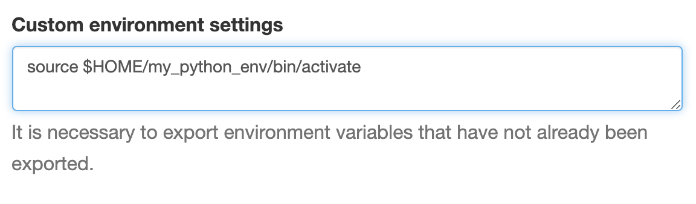

# Python Virtual Environments

One method of installing Python packages is to use [virtualenv](https://virtualenv.pypa.io/en/latest/). A subset of ```virtualenv```
is included by default since _Python 3.3_ as the _venv_ module.

The usage of both methods is essentially identical (you can see some of the additional capabilities of ```virtualenv``` [here](https://virtualenv.pypa.io/en/latest/).)

## Creating a virtual environment

The general workflow is to do the following:

1. Load a version of Python and possibly a newer set of compilers
2. Create the virtual environment
3. Activate the virtual environment
4. Ensure ```pip``` is up to date
5. Install packages with ```pip```

### Load Python and compilers

In more detail, we first load the version of _Python_ that we'd like to
use. (NOTE: ```venv``` requires _Python >= 3.3_). You can see which versions
of _Python_ are installed with the command

```bash
module avail python
```

from a terminal. You can access a terminal by logging into the system using SSH or by accessing the shell from Clusters menu at the top of the OnDemand portal at hpc.smu.edu.

The _Intel_ compiler suites also include a version of _Python_ and may not show up in the ```module avail``` search.

Since ```pip install``` often compiles packages, it is generally a good idea to also load a newer compiler suite to make sure everything compiles as expected. Some of the compilers, such as the ones from _Intel_ as mentioned above come with their own version of _Python_, you should load the compiler first, then the _Python_ version you want to use.

You can see some of the compilers installed with the following commands:

```bash
# list the available GNU compilers
module avail gcc

# list the available Intel compilers
module avail intel

# list the available compilers in the Nvidia HPC SDK
module avail nvhpc
```

For example, these are some popular _Python_ and compiler combinations (practically speaking they're all about the same, but depending on the application sometimes one performs a bit better)
<!-- tabs:start -->
#### **GCC + Python 3**

```bash
# load a newer version of GCC, the default is v4.8.5 
# and too old to compile some programs
module load gcc-9.2

# load python 3
module load python/3
```

#### **Intel Python 3**

```bash
# load a recent Intel compiler suite. This comes 
# with a version of Python 3
module load intel/oneAPI-2021
```

#### **Nvhpc + Python 3**

```bash
# load a Nvidia HPC SDK suite
module load nvhpc-21.2

# load python 3
module load python/3
```

<!-- tabs:end -->

### Create the environment

The next step is to create the virtual _Python_ environment. Here, we create an environment called ```my_python_env``` in our home directory. You can rename the environment to anything you like and also change the location where it is saved (for instance it's a good idea save environments in project specific folders.)


<!-- tabs:start -->
#### **venv**

```bash
python -m venv $HOME/my_python_env
```

#### **virtualenv**

```bash
virtualenv $HOME/my_python_env
```

<!-- tabs:end -->

### Activate the environment

After creating the environment, we can activate it so anything we install is contained inside the environment.

```bash
source $HOME/my_python_env/bin/activate
```

### Make sure pip is up to date

Depending on which version of _Python_ you are using, the version of
```pip``` may be quite a bit out of date, so it is advisable to make 
sure it is up to date

```bash
pip install --upgrade pip
```

### Install packages

After ```pip``` has been updated, install any packages needed. For example, we can install ```numpy``` with

```bash
pip install numpy
```

### Exiting the virtual environment

To exit the virtual environment, run the command:

```bash
deactivate
```

### Tips for reproducibility

It is good idea to save environments. From inside an active environment (after you have called ```source $HOME/my_python_env/bin/activate```) it is possible to output a list of all the packages installed along with their versions:

```bash
#export a list of installed packages
pip freeze > requirements.txt
```

This list of packages can be used to restore all the packages that were installed using

```bash
# install all of the packages from an exported list
pip install -r requirements.txt
```

This can make it easier to set up environments on different systems or for recording your environment for publications. Note: not all packages are available on all systems so this may not work if you are moving from a Linux machine to a Windows machine, for example. However, it is still useful as a starting place for setting up environments as similarly as possible.

## Using virtual environments

To use virtual environments, we just need to load them before running our programs. This looks a bit different depending on how you are running.

### Using the HPC Portal hpc.smu.edu

If you are running interactive sessions through the portal using _Jupyter Notebook_ or _JupyterLab_, you first need to make sure ```JupyterLab``` is installed in your environment. To do this, while inside the environment (after you have called ```source $HOME/my_python_env/bin/activate``` from a terminal), run

```bash
pip install jupyterlab
```

If you skip this step, the portal will default back to the system version of _Python_ instead of your environment. You only have to do this installation step once per environment you set up.

After installing ```JupyterLab```, all you have to do is add the activation command

```bash
source $HOME/my_python_env/bin/activate
```

to the ```Custom environment settings``` field on the portal. It should look like:



### Interactively from the terminal

If you are running programs interactively from the terminal (e.g. using ```srun```) just activate the virtual environment with

```bash
source $HOME/my_python_env/bin/activate
```

in the terminal before running any commands.

### Using SBatch scripts

If you are running programs using _SBatch_ scripts, you should include the activation command in your script:

```bash
source $HOME/my_python_env/bin/activate;
```

This should come after the ```#SBATCH``` directives and after any modules you load, but before you run your application.

## Tips

- It is good practice to use a unique virtual environment for each project.
- If you need to update a package inside an environment, it is a good idea to build a new, clean environment with that update to avoid potential dependency problems that may arise.
- Choose meaningful names and/or organize environments into project folders. No one will remember when ```env3``` contains or was used for 6 months from now.

## Additional Resources

* [virtualenv documentation](https://virtualenv.pypa.io/en/latest/index.html)
* [venv documentation](https://docs.python.org/3/library/venv.html)