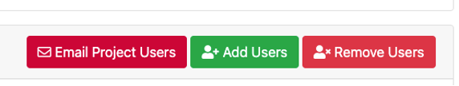
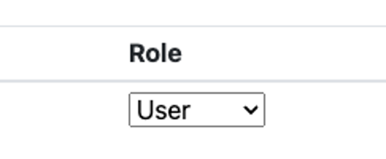

# ColdFront

## Creating a Project

1. Login to ColdFront via SSO with your SMU ID and Password 
2. Select Add a project 
3. Complete the fields  
4. Select Save once complete.

Once Project is created you will have multiple options to Add additional users, request allocations, add Grant information, and publications.

## To Add Users

1. Once your project is created, select Add Users within the Users section of your project

2. If you are searching by “Exact Username Only” search for the user via SMU email alias
    <ol type="a">
        <li>NOTE: If you are adding multiple users, you can list them all in the Search String box</li>
    </ol>

3. If you are searching by “All Fields” you can enter last name or SMU email alias

4. Once you’ve found and selected the user(s), select the role the user should have

5. Then Add Selected Users to Project
6. Once complete you will see all users requested under the Users section