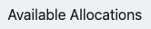
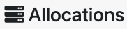
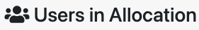
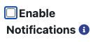

# Add or Remove Users

```{note}
Students enrolled in a course will be added automatically as a ***User*** in a class close to the course start date and cannot be removed.
```

## Roles

Instructors and PI's are automatically assigned the ***Manager*** role within a project. Other users are either a ***Manager*** or a ***User***, with the following permissions:

| Role | Permissions |
| -------- | ------- |
| ***Manager*** | add users, remove users, request allocations, use allocations |
| ***User*** | use allocations |

## Add a User

### To a Project/Class

```{dropdown} Video Walkthrough
<iframe src="https://smu.app.box.com/embed/s/e0pm5rufj25hx7af5bea1s59pri76x57?sortColumn=date" width="100%" height="550" frameborder="0" allowfullscreen webkitallowfullscreen msallowfullscreen></iframe>
```

1. Once a project or class is created, under Manage Project, click on 

2. Type in usernames of the user(s) you would like to add separated by a space or on separate lines.

    ```{image} ../images/CF/add_remove_users/search_user_space.png
    :alt: search users by space
    :height: 150px
    ```

    ```{image} ../images/CF/add_remove_users/search_user_line.png
    :alt: search users by line
    :height: 150px
    ```

3. Click on 

    ````{note}
    If a user has already been added to the project or class, then you will see a message like this
    ```{image} ../images/CF/add_remove_users/user_already_added.png
    :alt: user already added message
    :height: 35px
    :align: center
    ```
    ````

4. Select which allocation you would like users to be added to within the project under .

5. Select the user(s) that you want to add from the list 

    ```{image} ../images/CF/add_remove_users/select_user.png
    :alt: select users
    :height: 60px
    ```

    and change their role to either ***Manager*** or ***User*** using the dropdown.

    ```{image} ../images/CF/add_remove_users/user_role.png
    :alt: user role selection
    :height: 60px
    ```

6. Click on 

7. You can verify that a user has been added under Users on the Project/Class page.

### To an Allocation

```{note}
When [requesting an allocation](https://southernmethodistuniversity.github.io/hpc_docs/coldfront/request_change_allocation.html) you can give permissions to existing users. When [adding a user to a project initially](https://southernmethodistuniversity.github.io/hpc_docs/coldfront/add_remove_users.html#from-a-project-class), you can add them to active allocations. The following instructions are for adding existing users to an active allocation. 
```

1. Navigate to the Allocation details page by clicking on the allocation under  in the  panel.

2. Scroll down to the  panel and click on .

3. Select which users to add to the allocation. If it is a ***Storage*** allocation, you will also need to select their **Permissions** (*Read and Write* or *Read Only*).

4. Click on .

5. The user will still need to accept the Policies and Guidelines to use the allocation.

## Remove a User

### From a Project/Class

1. Click on  in the header next to .

2. Select the user(s) that you want to remove from the list.

    

3. Click on .

4. You can verify that a user has been removed under  on the Project/Class page.

### From an Allocation

## Change User

### Role

1. Next to the user's role you would like to change, click on  under Actions.

2. Change their role using the dropdown:

    

3. Click on 

### Allocation Permissions (for ***Storage*** allocations only)

1. Navigate to the Allocation details page by clicking on the allocation under  in the  panel.

2. Scroll down to the  panel and click on .

3. From the , set the desired Permissions.

    ````{note}
    Occassionally, it takes a while to provision users on the actual HPC systems. If you see a message like this
    
    ```{image} ../images/CF/add_remove_users/no_eligible_users.png
    :alt: No users in project are currently eligible for a permissions change
    :height: 30px
    :align: center
    ```

    either your users have not accepted the Policies and Guidelines yet, or they are still being provisioned with their original permissions.
    Check back in a few hours and users may be eligible for a permissions change.
    ````

4. Click on .

### Notification Settings

1. Under **Users** on your project page, you will see a column to .

2. Check or uncheck the box to enable or disable notifications for all users, or do so individually for each user.

    ```{note}
    You cannot disable notifications for someone with the ***Manager*** role. As the PI or Instructor, you are responsible for monitoring changes to allocations in your projects.
    ```