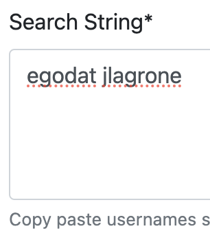
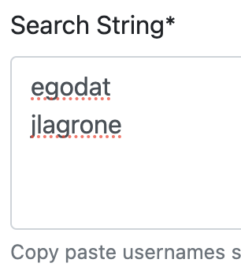
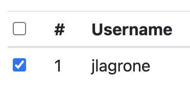
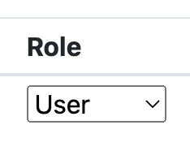
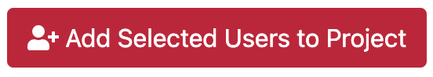
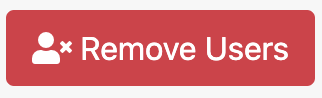
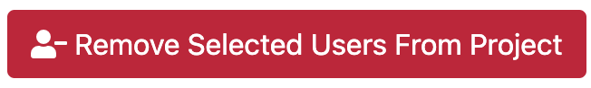
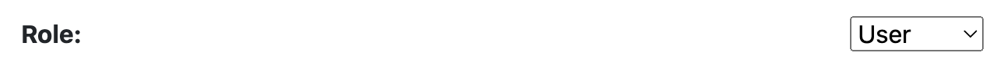

# Add or Remove Users

> Students enrolled in a course will be added automatically as a ***User*** in a class close to the course start date and cannot be removed.

## Roles

Instructors and PI's are automatically assigned the ***Manager*** role within a project. Other users are either a ***Manager*** or a ***User***, with the following permissions:

| Role | Permissions |
| -------- | ------- |
| ***Manager*** | add users, remove users, request allocations, use allocations |
| ***User*** | use allocations |

## Add a User

1. Once a project or class is created, under , click on .

2. Type in usernames of the user(s) you would like to add separated by a space or on separate lines.

     

3. Click on

    

    > If a user has already been added to the project or class, then you will see a message like this\
    > .

4. Select the user(s) that you want to add from the list 

     

    and change their role to either ***Manager*** or ***User*** using the dropdown.

    

5. Click on

    .

6. You can verify that a user has been added under  on the Project/Class page.

## Remove a User

1. Click on  in the header next to .

2. Select the user(s) that you want to remove from the list.

    

3. Click on

    .

4. You can verify that a user has been removed under  on the Project/Class page.

## Change a User Role

1. Next to the user's role you would like to change, click on  under Actions.

2. Change their role using the dropdown:

    

3. Click on

    