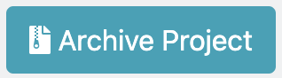

# Archive a Project

When you are ready to fully close a project on ColdFront, you can archive it. Once you archive a project, your allocations will expire.

```{admonition} Important
:class: warning
Once a project is archived, you will not be able to recover any data stored in a **Storage** allocation. If you need to keep the data, we recommend moving it to your `$HOME` directory, or storing it elsewhere off of the HPC systems. If you need to use the same data over multiple ColdFront projects, you may want to set up a separate project with its own **Storage** allocation, which you can access from **Compute** allocations in your other projects. Once your data is moved over, you can proceed with archiving your project.
```

TO archiv your project:

1. Navigate to your project, and click on  next to the  panel.

2. You will see the following message. Please read carefully before archiving.

    ```{image} ../images/CF/archive_project/warning_message.png
    :alt: Are you sure you want to archive this project? This will expire all your allocations on this project, which will disable your group's access to the resources in those allocations.
    :width: 800 px
    ```

3. Click on **Yes** to archive your project and expire your allocations.