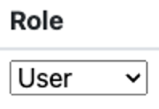
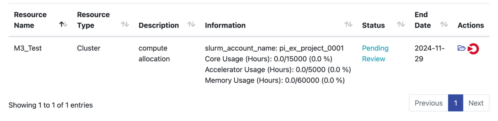
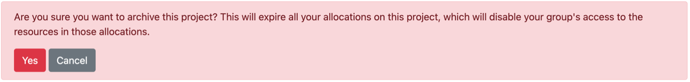

# Quick Start

## Creating a Project

1. Login to ColdFront via SSO with your SMU ID and Password 
2. Select Add a project 
3. Complete the fields  
4. Select Save once complete.

Once Project is created you will have multiple options to Add additional users, request allocations, add Grant information, and publications.

## To add users

1. Once your project is created, select Add Users within the Users section of your project

    

2. If you are searching by “Exact Username Only” search for the user via SMU email alias

    > NOTE: If you are adding multiple users, you can list them all in the Search String box

3. If you are searching by “All Fields” you can enter last name or SMU email alias

4. Once you’ve found and selected the user(s), select the role the user should have

    

5. Then Add Selected Users to Project
6. Once complete you will see all users requested under the Users section

## To Request Resource Allocations

1.	Next to Allocations, Select the **+Request Resource Allocation button**
2.	Complete all required fields
3.	Select the users you’d like to add to this allocation
4.	Select Submit
5.	Once complete you will see your status request as **Pending Review** under Allocations

    

## To view your current usage

1.	Under Allocations select the folder icon
2.	You will see your Allocation details, EULA Agreements, and Usage by Hours

## To add a class for HPC Access [Faculty/TA ONLY]

1.	Select the **Add a Class** button

    

2.	Select your Course and additional sections (if necessary)

    > NOTE: If you are adding multiple users, you can list them all in the Search String box

3. Check the additional boxes below the sections based off need of the class

4. Select **Save**

    All students enrolled in class will show under Users

    > NOTE: All students will appear 7 days before the semester begins.

    The Allocations selected previous will show under Allocations, however if additional ones are needed you can add by clicking on the **+Request Resource Allocations** button

    

## Archive a Project

1.	After logging into ColdFront, select your project from the Home Screen
2.	Select **Archive Project** top right of the page
3.	To Archive select “Yes” after reading the disclaimer

    

4. Once you project is successfully archived, you will not be able to make any changes but will still be able to view some details at any time

## To view Archive Projects

1.	After logging into ColdFront, select Projects> Projects
2.	Top right of your page, you will see View Archived Projects

    
