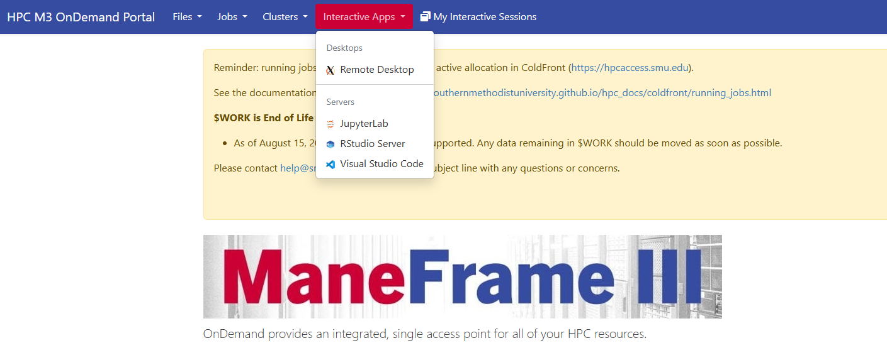

# Digital Humanities Workshop

HPC can support digital humanities research by Ithaka Constellate Notebooks is a platform for learning these techniques without any prior technical experience required. It is currently available as a GitHub repository which can be accessed as a Jupyter workspace containing organized folders and Python files. This page aims to show you how to access the lessons in Jupyter-Lab.

There are also videos dedicated to most of the lessons in the workshop available here: [https://www.youtube.com/@Constellate_org](https://www.youtube.com/@Constellate_org)

1. Start Interactive JupyterLab from the [M3 OnDemand Portal](https://hpc.m3.smu.edu/pun/sys/dashboard/)
    * Under Select Python Environment, choose one of the following: (M3 Module) python/3.11.11/data_science/2025.04.01 or (M3 Module) python/3.11.11/data_science/2025.08.21
    * Ignore Custom environment settings
    * Leave rest settings to default values



2. Create/choose a place for storing the lessons. This is the parent directory of folder `constellate-notebooks`. The file explorer on the left of Jupyter-Lab is limited to the \$HOME directory; however, one can enter the \$SCRATCH directory by copying and pasting `cd $SCRATCH` to a separate line and then pressing the Enter key.


3. Click on Terminal under Other in the Launcher tab. Type the following commands at the end of the latest line in terminal.


4. To see the folders and files present in the current directory, type `ls` in a separate line in the Terminal and then press the Enter key.

5. (Optional) To create a new folder in the current directory, type `mkdir DirectoryName` in a separate line in the Terminal, replacing `DirectoryName` with the name you want to give the parent directory and then press the Enter key.

6. Once the path of the chosen parent directory is present before the blinking cursor in the terminal, copy and paste the following command in  a separate line in the Terminal and then press the Enter key.
    ```
    git clone https://github.com/SouthernMethodistUniversity/constellate-notebooks.git
    ```
    This creates a copy of Constellate Notebooks in your parent directory. The course material is inside a new folder named `constellate-notebooks`.

    To **undo** the cloning process, just right-click and delete the folder with the default name `constellate-notebooks` in the directory you had chosen.