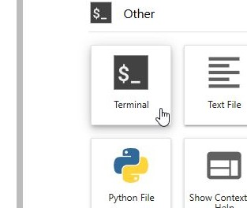
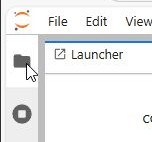
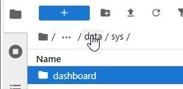
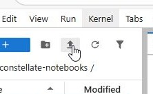
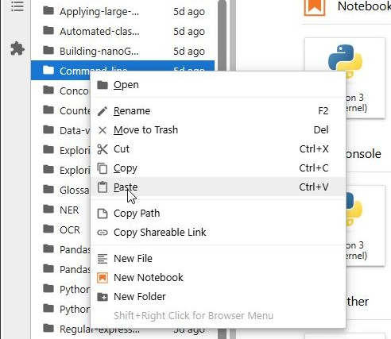
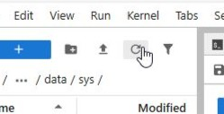
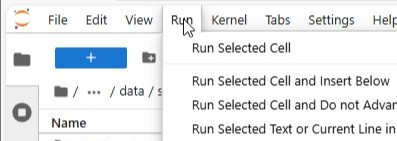
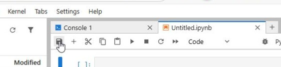
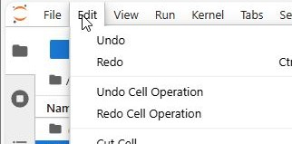

# Navigating Jupyter-Lab

Jupyter-Lab is a web-based interface containing a file explorer and a code editor that supports Python, Julia, and various other languages.

### File management

- **To open the Terminal**:
  - Click the blue button containing a plus sign at the top of the File Browser or the plus sign next to the rightmost tab to open a Launcher tab.
  - Click on Terminal to create a Terminal tab.

    


- **To open the File Browser**, click the folder icon 📁 on the left sidebar.

  

- **To enter a folder**, double-click on it.
- **To enter a parent directory**, a directory in the path of your location e.g. a folder containing the currently open folder: click on the name of the directory in the path above the column headers in the File Browser.

  

- **To upload a file** to the current location, click on the upload icon 📤 above the path.

  

- **To delete, rename, etc. a file**, right-click on a file or directory.
- **To paste copied file(s)**, right-click anywhere under the column header, then click Paste.
  
  

- **To open project directories** located outside your home directory (/$HOME or users/username) in the File Browser, you will need to create a symlink.
  - Click the plus sign at the top of the File Browser to open a new Launcher tab.
  - Click the Terminal button to open a new Terminal tab.
  - Copy and paste `ln -s "$ProjectDirectory" ~DirectoryOfLink` into the Terminal, replacing `$ProjectDirectory` with the path of your project directory and `DirectoryOfLink` with the desired position of the link in your $HOME directory. Press Enter.
  - Navigate to the path of the symlink. Click the refresh button in the top right corner of the File Browser ⟳ if required.
  
      
  
  - The project directory can now be opened in the File Browser by double clicking the symlink.

### Code editing

Jupyter contains cells that can be run individually. These cells can run either markdown or the language of the Kernel visible in top right corner of a .ipynb document tab. Python3 comes already installed with Jupyter-Lab. Cells can also contain Magic Commands that are outside the standard functionality of Python.
- **To open a new notebook**:
  - Click the plus sign next to the currently open tab on the right side of Jupyter-Lab in case there isn't a Launcher tab already open.
  
    

  - In the Launcher tab, click on the desired kernel type under Notebook to open a new notebook.

     

- **Run options** can be chosen by clicking the 'Run' tab in line with the Jupyter logo at the top, then clicking the desired run option.

    

- **To save or create a new checkpoint**, click on the memory card icon under the .ipynb tab or simultaneously press the Ctrl and S keys.

    

- **Cell operations** like creating cells, copying them, etc. can be done by clicking on the 'Edit' tab in line with the Jupyter logo at the top, and then clicking the desired operation. 

    

- **To open a new Python file**, open the Launcher tab, then click on Python File under Other.

  

- **To run a Python file**:
  - Method 1:
    - Open a Terminal.
    - Type `python path_to_py_file`, replacing `path_to_py_file` with the path to the Python file.
    - Press Enter. The output is displayed within the Terminal.
  - Method 2:
    - Open a notebook.
    - Copy and paste the following in a separate line of a cell, replacing `path_to_py_file` with the relative path to the Python file:
      ```
      %run path_to_py_file
      ```
    - Run the cell. The output for the Python file is displayed under the cell.
   

### Additional Help
[This website](https://jupyterlab.readthedocs.io/en/latest/user/notebook.html) contains in-depth instructions on navigating Jupyter-Lab Notebooks.